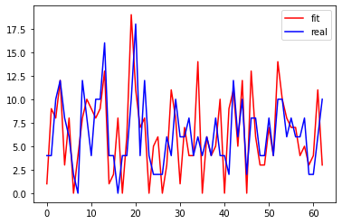
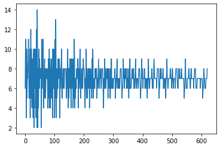
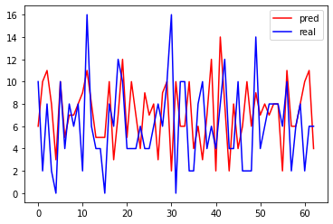

## 使用双季节指数平滑模型预测来电序列

### 简介

本文使用  *[James W. Taylor, (2008) A Comparison of Univariate Time Series Methods for Forecasting Intraday Arrivals at a Call Center. Management Science 54(2):253-265. ](https://doi.org/10.1287/mnsc.1070.0786)* 中提出的双季节指数平滑模型——DoubleSeasonalHoltWinter模型拟合来电时间序列，通过遗传算法(GA)进行参数估计，并使用参数估计后的模型进行预测，分析对比拟合结果。

### 数据处理

本文使用James的论文中使用的来电时间序列数据，但由于原数据记录的是每个来电的时间，因此我们需要将原数据进行处理，得到工作时间内（9: 00-18: 00）每小时来电数量时间序列。

我们将经过处理后的数据划分为训练集（2015-01-01至2015-01-21）和测试集（2015-01-21之后）。

### 模型介绍

James在论文中开创性地提出了双季节指数平滑模型，模型公式如下：

### 参数估计

通过上述公式可以看出模型存在五个待估计参数 $\alpha\ \gamma\ \delta\ \omega\ \phi$， 本文使用遗传算法进行参数估计。

设定候选解个数和最大迭代次数分别为 $candidates$ 和 $max\_iter$ 。

**初始化**：生成 $candidates$ 个初始解，初始每个参数为随机生成的[0,1]随机数；

**适应性函数(fitness function)**：使用初始解拟合训练集数据，得出MSE作为适应性函数；

**交叉和选择**：将候选解按照适应性函数值大小进行排序（降序），并选取相邻候选解作为父类，将父类参数进行算数平均得到子类加入候选解中，并剔除掉适应性函数值较大的候选解（保持候选解个数始终为 $candidates$ ）；

**变异函数**：每次得到子类时，随机选取子类的一个参数，e. g. $\alpha$ ，乘以 [1,1/$ \alpha $] 的随机数；

**迭代次数**：达到最大迭代次数 $ max\_iter $ 停止。

### 预测

使用遗传算法求解出的参数进行预测。因为来电个数一定为正整数，因此对于每一个预测值，我们都先将它进行四舍五入（若小于0直接取0）处理，再预测下一期的值。

### 结果

**模型拟合** $ MSE=11.883597883597883 $ ；

**模型预测** $ MSE=14.880837359098228 $ ；

**参数选择** 

| alpha  | gamma  | delta  | omega  | phi    |
| ------ | ------ | ------ | ------ | ------ |
| 0.6696 | 0.0788 | 0.0788 | 0.4836 | 0.3438 |

**拟合图(截取了一个周期)**

**预测图（全预测期）**

**预测值与真实值对比图（截取了最近一个周期）**

### 结论

通过模型拟合结果可以看出，随着预测期的增加，预测效果逐渐下降；

对于训练集，模型拟合效果较好；对于测试集，在较近的预测期内预测效果较好。